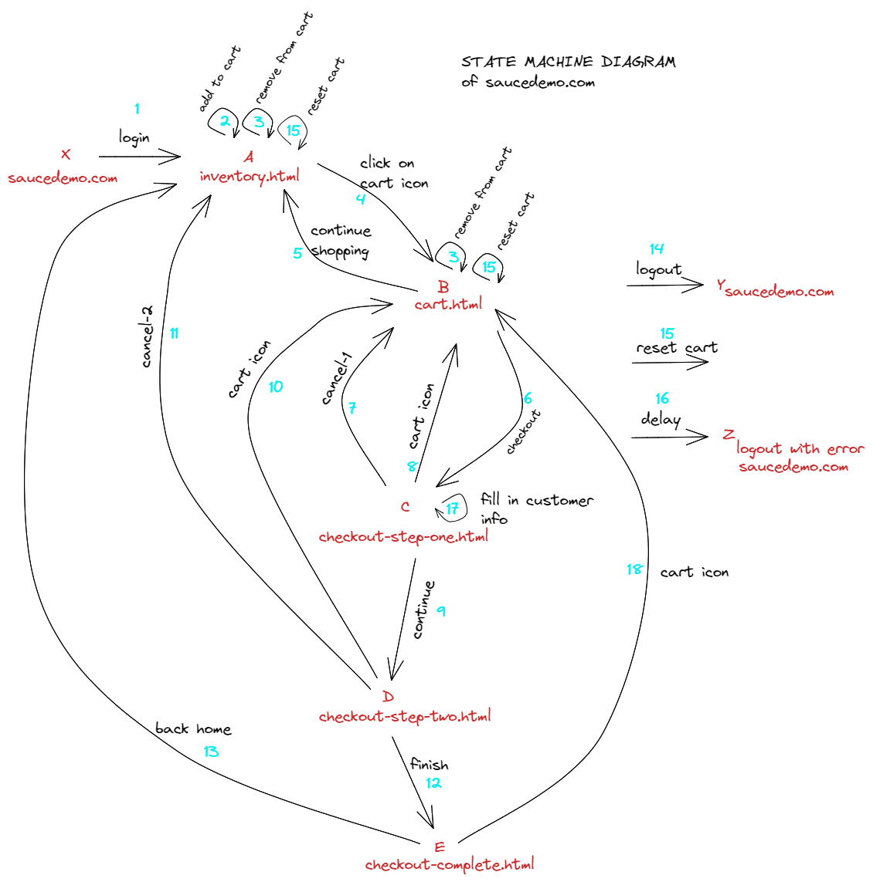
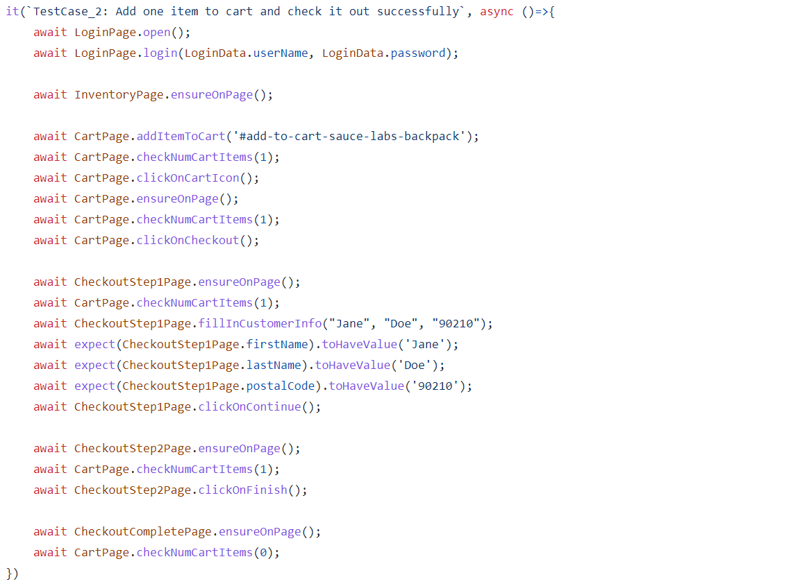
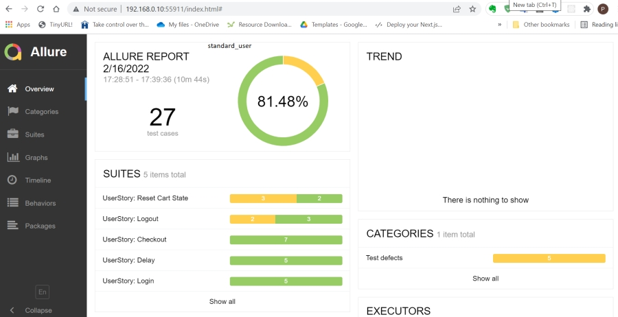
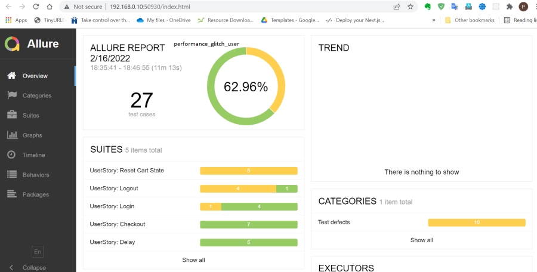
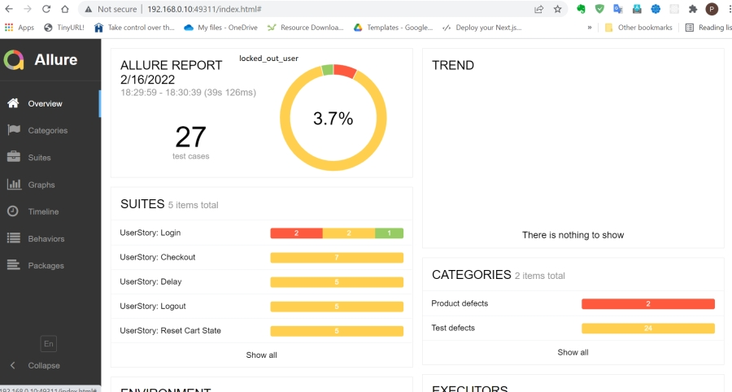

# Testing a shopping cart application using a Finite State Machine

## Overview

We will be using [WebDriverIO](https://webdriver.io/), which is a browser test automation framework for Node.js. 

An eCommerce demo site called [Swag Labs](https://www.saucedemo.com/) is a simple shopping cart application with a 2 step checkout process. 

## Notable with the target test site

The demo application will log you out after 10 minutes. This is part of the design of the site and this functionality is also tested in the state machine. 

## Finite State Machine
Play with the application at [Swag Labs](https://www.saucedemo.com/) and then see the State Machine diagram below. The letters in Red are states. The arrows with the Turquoise numbers are transitions.

 

This state machine diagram works as a mental model of the application, and walking through the various paths of the state machine can give one reasonable confidence about end-to-end integration testing of the application. However, it must be noted that this state machine is only a ***proxy*** for the state machine used to implement the actual application code and there is room for error and one cannot have 100% confidence that there are no hidden bugs in the said application.

That said, having a mental model of a state machine is useful when writing a test plan.

## Test Cases
Here is a snippet of code that walks through a simple checkout. It walks through the path `X 1 A 2 4 B 6 C 17 9 D 12 E` in the above state machine diagram.

[Checkout Test Cases](./docs/StateDiagramCheckoutTestCases.md)

[Reset and Login Test Cases](./docs/StateDiagramLoginResetTestCases.md)

## Test Results

Clicking on the Burger menu -> Logout or Reset Application is a bit flaky in the automated tests, so these tests are showing up as yellow in the below screenshots.

The Page Object Model(POM) was used to write these tests. The classes created in the POM `throw` errors, which currently shows up as a test defect(instead of product defect) in the allure results. The actual [test cases](/test/specs) are clean, with `await object.method()` and can serve as living documentation for each test.

### Allure Reports

Here are some screen shots of a run of the test results for the various users using the _allure_ reporting tool.

***standard_user:***

***problem_user:***

***performance_glitch_user:***

***locked_out_user:***

### html-nice-reporter

Here are some reports you can interact with. This was a different run from the allure reports above.

[standard_user](https://pramam.github.io/webdriverio-saucedemo-testing/reports/html-reports/standard_user/master-report.html)

[problem_user](https://pramam.github.io/webdriverio-saucedemo-testing/reports/html-reports/problem_user/master-report.html)

[performance_glitch_user](https://pramam.github.io/webdriverio-saucedemo-testing/reports/html-reports/performance_glitch_user/master-report.html)

[locked_out_user](https://pramam.github.io/webdriverio-saucedemo-testing/reports/html-reports/locked_out_user/master-report.html)

## Existing Files

| File | Description |
| ------ | ------ |
| /test/specs/*.e2e.js | Each file tests a checkout path through the state machine|
| pageobjects/page.js | Base page object used for sharing across all pages |
| pageobjects/*.page.js | Page objects for the various pages |
| ./wdio.config.js | Base configuration file set to use Chrome as default browser |

## Running tests

1. Setup a new project in your preferred IDE with these project files: `git clone https://github.com/pramam/webdriverio-saucedemo-testing`
2. Run `npm install` to install the latest version (requires you have [node.js installed](https://nodejs.org/en/download/))
3. Run `npx wdio run ./wdio.conf.js` to run all the tests. Some tests check if the user is logged out after 10 mins, so expect the test suite to take 10-11mins to complete.
4. Run `npx wdio run ./wdio.conf.js --spec checkout1.e2e.js` to run the specified spec file. 
5. Running the tests creates allure reports and html reports, using both reporters. The allure reports are stored in `allure results` and the html reports are stored in `docs/reports/html-reports`. The html master report is at `docs/reports/html-reports/standard_user/master-report.html`. Run `rm -rf allure-results` and `rm -rf docs/reports/html-reports` to get fresh results.
6. Run `allure generate allure-results --clean && allure open` to generate a report; `allure generate --clean && allure open` also works as `allure-results` is a default
7. To clean up results from a prior run `rm -rf allure-results` and `rm -rf docs/reports/html-reports`
8. The default username/login is in [this file](./data/logindata.js). Change the username in this file to run the automation with a different user account.
